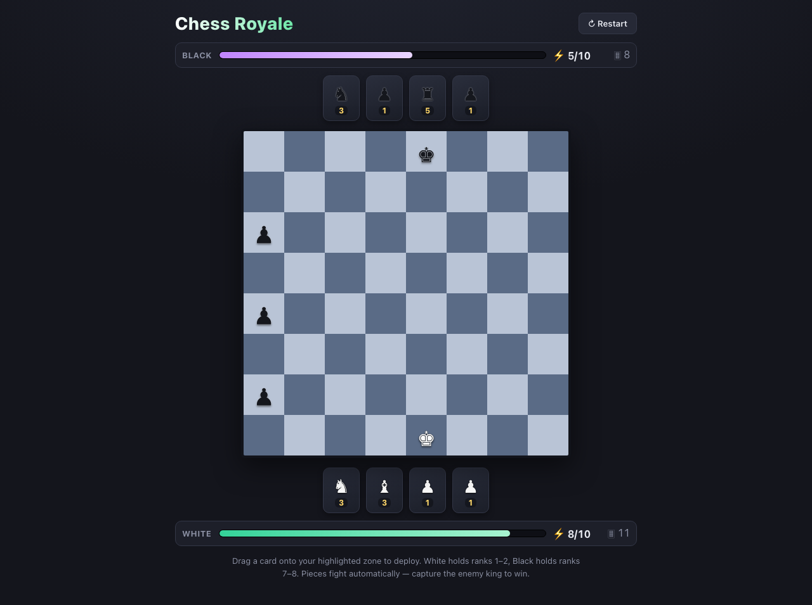

# Chess Royale

A real-time 2D browser game that mixes **Clash Royale pacing** with **chess mechanics**.
Both players share one keyboard/screen (local hot-seat), deploy pieces from a card hand using
energy, and the pieces then fight **automatically** in real time. Capture the enemy king to win.



## Tech stack

- **Vite + React 19 + TypeScript** — app shell & rendering
- **Zustand** — game state store
- **@dnd-kit/core** — drag cards from hand onto the board
- **Vitest + jsdom** — game-logic unit tests
- **Playwright** — browser smoke + 60-second soak test
- Plain **CSS** — no UI framework
- **No backend** — both players play in the same browser

## How to run

```bash
npm install        # install dependencies
npm run dev        # play at http://localhost:5173

npm test           # run the Vitest unit suite
npm run build      # type-check + production build
npm run e2e        # Playwright smoke + 60s soak test (auto-starts the dev server)
npm run preview    # serve the production build
```

> First-time Playwright run only: `npx playwright install chromium`.

## How to play

- The **board is the first screen** — no landing page.
- **White** owns ranks **1–2** (bottom); **Black** owns ranks **7–8** (top).
- Each side starts with only its **king** on the board (White e1, Black e8). Kings never move.
- Drag a card from your hand onto a **highlighted** square in your zone to deploy it. Highlights
  turn green for legal squares; an illegal hovered square flashes red.
- Deploying costs **energy** (regenerates 1 per 1.5s, starts at 5, caps at 10).
- Deployed pieces move and fight on their own every ~0.9s. **Capture the enemy king to win.**

### Rules summary

| Rule | Detail |
|------|--------|
| Deck | 15 non-king cards each: 8 pawns, 2 knights, 2 bishops, 2 rooks, 1 queen (shuffled) |
| Hand | 4 cards; draw a replacement immediately after deploying (if the deck has cards) |
| Costs | pawn 1, knight 3, bishop 3, rook 5, queen 9 |
| Capture recycling | A captured **non-king** piece returns to its owner's deck and is reshuffled |
| Empty deck | The hand simply stops refilling until captured pieces cycle back |
| Promotion | A pawn reaching the final rank becomes a queen |
| Win | Capturing the enemy king ends the game |

### Automatic piece behavior (every action tick)

1. Capture the enemy **king** if a legal capture exists.
2. Else capture the **highest-value** reachable enemy piece.
3. Else step one square **toward the enemy king** (reducing distance).
4. Else step one square **toward the nearest enemy piece**.

Pieces obey chess directions: knights jump; rooks/bishops/queens slide and are blocked by
occupied squares; pawns move forward by owner direction and capture diagonally forward.
Repositioning moves are **one square at a time** (knights one jump) so the action stays readable
and blocking is meaningful — captures use full chess range.

## Architecture

```
src/
├── game/                 # pure, framework-free game logic (unit-tested)
│   ├── types.ts          # domain types
│   ├── constants.ts      # board size, costs, energy, timing, symbols, zones
│   ├── deck.ts           # deck creation + Fisher–Yates shuffle
│   ├── movement.ts       # legal chess moves + one-step repositioning
│   ├── targeting.ts      # auto-behavior decision tree
│   └── gameEngine.ts     # initial state, deploy, real-time tick, win/promotion
├── store/
│   └── gameStore.ts      # Zustand store wrapping the engine + drag state
├── components/
│   ├── Board.tsx         # 8×8 grid, deploy-zone highlighting
│   ├── Square.tsx        # droppable cell + piece glyph
│   ├── Hand.tsx          # a player's cards
│   ├── Card.tsx          # draggable card (energy-gated)
│   └── EnergyBar.tsx     # energy bar + value + deck count
└── App.tsx               # DndContext, real-time loop, layout, winner overlay, restart
e2e/                      # Playwright smoke + soak tests
```

The game logic in `src/game/` is **pure** (no React, no DOM) and deterministic given a clock value,
which is what makes it unit-testable. The store drives a `setInterval` loop (250 ms) that calls the
engine's `tick(state, now)`.

## What's complete

- 8×8 board, kings pre-placed, stationary kings as targets.
- Shuffled 15-card decks, 4-card hands, draw-on-deploy, empty-deck handling.
- Energy: start 5, max 10, regen 1 / 1.5 s, standard chess costs, energy-gated cards.
- Drag-and-drop deployment with deploy-zone validation, legal-square highlighting, invalid feedback.
- Real-time deterministic game loop (250 ms tick, ~900 ms per-piece cooldown).
- Full custom movement/capture for every piece type, blocking, pawn direction, promotion.
- Automatic targeting decision tree (king > highest-value capture > toward king > toward nearest).
- Captured non-king pieces recycle into the owner's deck (visible via the deck counter).
- Winner overlay + restart button; both energy bars and deck counts on screen.
- 21 Vitest unit tests; Playwright smoke test (64 squares, hands, energy, reset, **no console errors**);
  60-second soak test (6 games played out, zero console errors, no crash).

## Known MVP limitations

- **Local hot-seat only** — no networking/AI; both hands are human-controlled in one browser.
- Pawns move **one square** (no two-square opening, no en passant, no castling).
- No check/checkmate, no health/damage — capturing the king is the only win condition.
- Promotion is always to a **queen**.
- Sliding pieces **reposition one square per action** (captures use full range) — a deliberate
  readability/strategy choice, not standard chess sliding for movement.
- Targeting is greedy/deterministic (no lookahead), so pawns can stall in front of a king they
  can't capture head-on until a flanking piece arrives.
- A captured promoted pawn returns to the deck as a **queen** card.

## License

TBD
